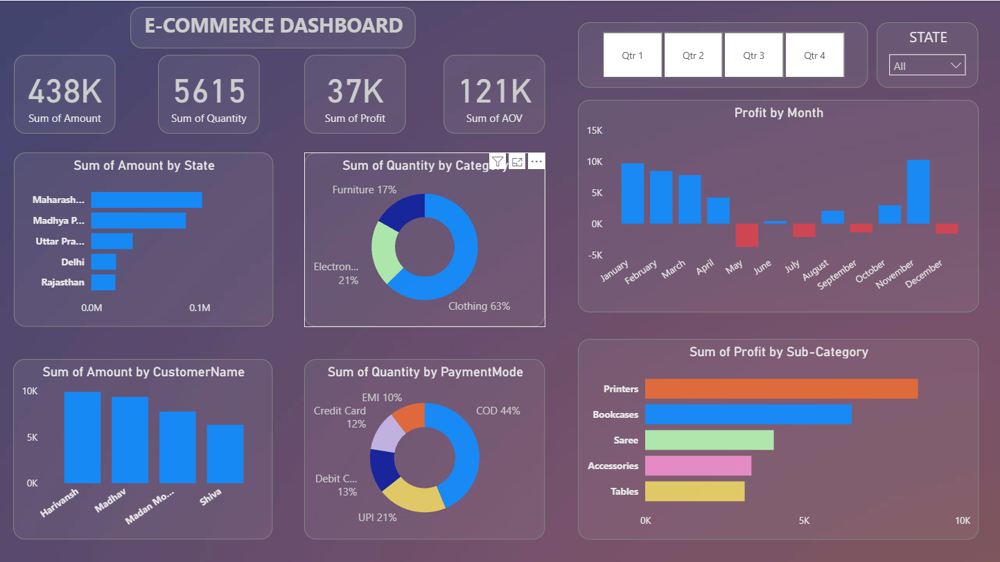
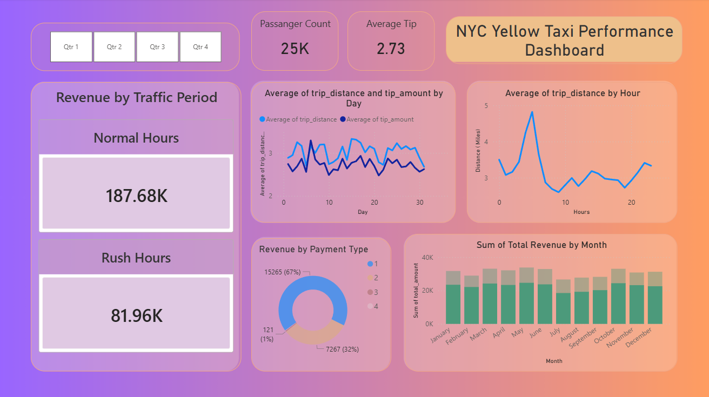

# 📊 Power BI Dashboards — Omkar Mane

<p align="center">
  
  
  
  
</p>

<p align="center">
  <b>Interactive business intelligence dashboards built in Power BI Desktop.</b><br/>
  Real-world datasets · DAX measures · Power Query transformations · Business storytelling
</p>

---

## 📁 Dashboards at a Glance

| # | Dashboard | Domain | Dataset | File |
|---|-----------|--------|---------|------|
| 1 | E-Commerce Sales Dashboard | Retail / E-Commerce | E-commerce transaction data | `E_Commerce_dashboard.pbit` |
| 2 | NYC Yellow Taxi Performance Dashboard | Urban Transportation | NYC TLC Open Dataset | `NYC Yellow Taxi Performance Dashboard.pbit` |

---

## 🛒 Dashboard 1 — E-Commerce Sales Dashboard

> **Objective:** Give e-commerce business stakeholders a single-screen view of sales performance, customer behavior, and product trends — enabling fast, data-driven decisions.

### Business Questions Answered
- Which product categories are driving the most revenue?
- How is monthly and quarterly revenue trending over time?
- Which customer segments contribute the most to lifetime value?
- Which regions are underperforming vs. target?
- What is the average order value, and how does it vary by segment?
- Which are the top 10 best-selling products by revenue and volume?

### KPIs & Metrics Tracked

| KPI | Description |
|-----|-------------|
| 💰 Total Revenue | Gross sales revenue across all periods |
| 📦 Total Orders | Volume of transactions completed |
| 🧾 Average Order Value (AOV) | Revenue ÷ Orders — key profitability signal |
| 👥 Customer Segments | High-value vs. standard customer breakdown |
| 🌍 Regional Performance | Revenue and growth by geography |
| 🏆 Top 10 Products | Best performers by revenue and unit sales |
| 📈 Revenue Trend | Month-over-month and year-over-year growth |
| 🔄 Repeat Purchase Rate | Customer retention signal |

### Technical Highlights
- **DAX measures** for YoY growth %, running totals, and dynamic KPI cards
- **Power Query** transformations for data cleaning and category normalization
- **Drill-through pages** for product-level and region-level deep dives
- **Slicers** for interactive filtering by date range, category, and region
- **Conditional formatting** to highlight underperforming vs. overperforming segments

### Dashboard Preview



---

## 🚕 Dashboard 2 — NYC Yellow Taxi Performance Dashboard

> **Objective:** Analyze New York City Yellow Taxi trip data to surface operational performance insights, demand patterns, and revenue drivers for fleet managers and city planners.

### Business Questions Answered
- When are the peak demand hours and days for taxi services?
- Which NYC boroughs generate the highest trip revenue?
- How does trip distance correlate with fare amount and tip rate?
- What is the average fare per trip, and how does it vary by pickup zone?
- Are there identifiable patterns in driver performance across shifts?
- How do weather/time factors influence trip volume?

### KPIs & Metrics Tracked

| KPI | Description |
|-----|-------------|
| 🚖 Total Trips | Total trip volume over the analysis period |
| 💵 Total Revenue | Sum of all fare amounts collected |
| 📏 Avg. Trip Distance | Mean miles per trip — operational efficiency signal |
| 💲 Revenue per Trip | Average fare — profitability benchmark |
| ⏱️ Peak Hour Distribution | Demand curve by hour of day |
| 🗺️ Borough Breakdown | Revenue and trip count by NYC borough |
| 💡 Tip Rate Analysis | Tip percentage patterns by zone and time |
| 🌙 Day vs. Night Demand | Shift-level volume comparison |

### Technical Highlights
- **DAX measures** for dynamic averages, time intelligence, and borough ranking
- **Power Query** used to clean 1M+ row dataset — handling nulls, outliers, and data type issues
- **Map visual** for geographic borough-level revenue heatmap
- **Time-series line chart** with drill-down from month → week → day → hour
- **Bookmarks** for switching between "Revenue View" and "Operations View"
- **Tooltip pages** for contextual detail on hover

### Data Source
> NYC Taxi & Limousine Commission (TLC) — Open Data Portal  
> Dataset: Yellow Taxi Trip Records (publicly available at [data.cityofnewyork.us](https://data.cityofnewyork.us))

### Dashboard Preview



---

## 🛠️ Tools & Technologies

### Core Platform


### Data Transformation
-107C41?style=flat&logo=microsoft&logoColor=white)

**Techniques used:** Column profiling · Data type casting · Null handling · Conditional columns · Merge queries · Append queries · Custom functions

### Calculations & Logic


**DAX patterns used:** CALCULATE · FILTER · SUMX · AVERAGEX · DIVIDE · Time Intelligence (SAMEPERIODLASTYEAR, DATESYTD) · RANKX · IF/SWITCH · SELECTEDVALUE

### Visualization Types Used
`KPI Cards` · `Line Charts` · `Bar / Column Charts` · `Donut Charts` · `Map Visuals` · `Matrix Tables` · `Scatter Plots` · `Slicers` · `Drill-through Pages` · `Tooltip Pages` · `Bookmarks`

---

## ▶️ How to Use These Dashboards

### Prerequisites
- **Power BI Desktop** — free download from [Microsoft](https://powerbi.microsoft.com/en-us/desktop/)
- No Power BI Pro license needed to open `.pbit` files locally

### Steps

```
1. Download the .pbit file for the dashboard you want to explore
2. Open Power BI Desktop on your machine
3. Double-click the .pbit file — it will open automatically
4. If prompted to connect a data source:
   - For E-Commerce: connect to your own CSV/Excel sales data, or click Cancel to explore the template structure
   - For NYC Taxi: download the TLC dataset from data.cityofnewyork.us or use the sample data
5. Explore the report pages, slicers, and drill-throughs
```

> **Note:** `.pbit` files are Power BI templates — they contain all the report layout, measures, and visuals but prompt for a data source connection on first open. This keeps the file size small and the template reusable.

---

## 📂 Repository Structure

```
PowerBI-Dashboards/
│
├── E_Commerce_dashboard.pbit               # E-commerce BI template
├── Ecommerce_dashboard.png                 # Dashboard preview screenshot
│
├── NYC Yellow Taxi Performance Dashboard.pbit   # NYC Taxi BI template
├── NYC_Yellow_Taxi_Performance_Dashboard.png    # Dashboard preview screenshot
│
└── README.md
```

---

## 🔜 Coming Soon
'''

---

## 📬 Connect With Me

I'm actively seeking **Data Analyst / Business Intelligence roles in India**. Let's connect!

[](https://www.linkedin.com/in/omkar-mane-7b7b84194)
[](mailto:maneomkar23@gmail.com)
[](https://github.com/ManeOmkar26)

---

<p align="center"><i>"Good data visualization doesn't just show numbers — it tells the story behind them."</i></p>
